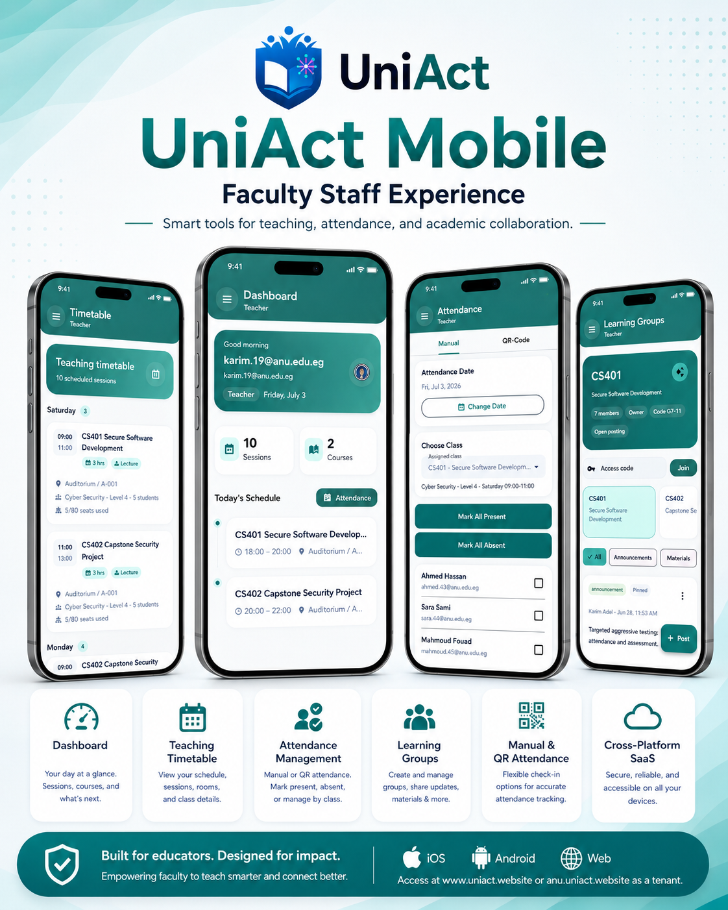
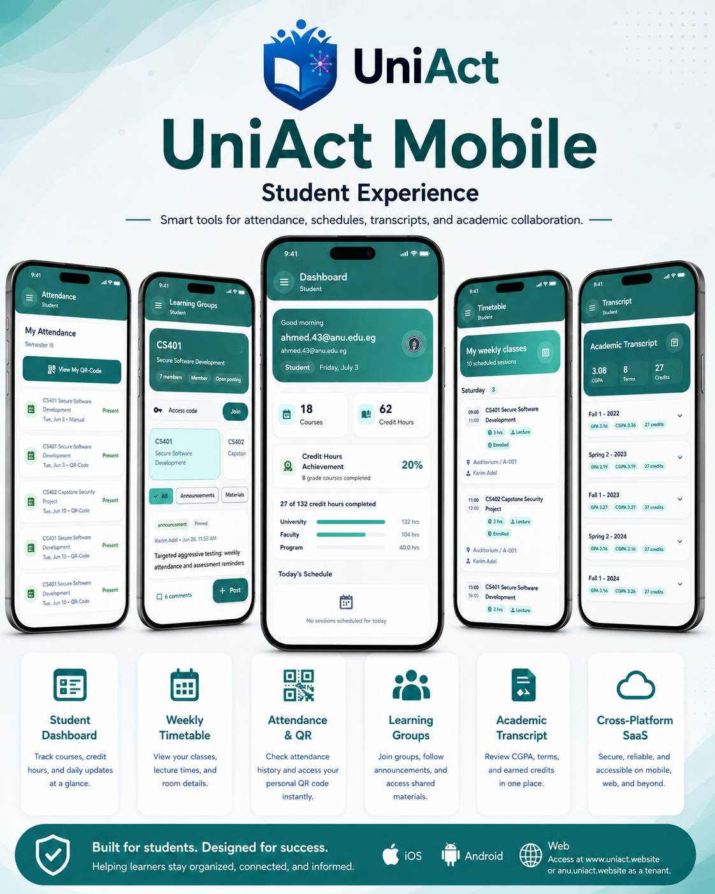
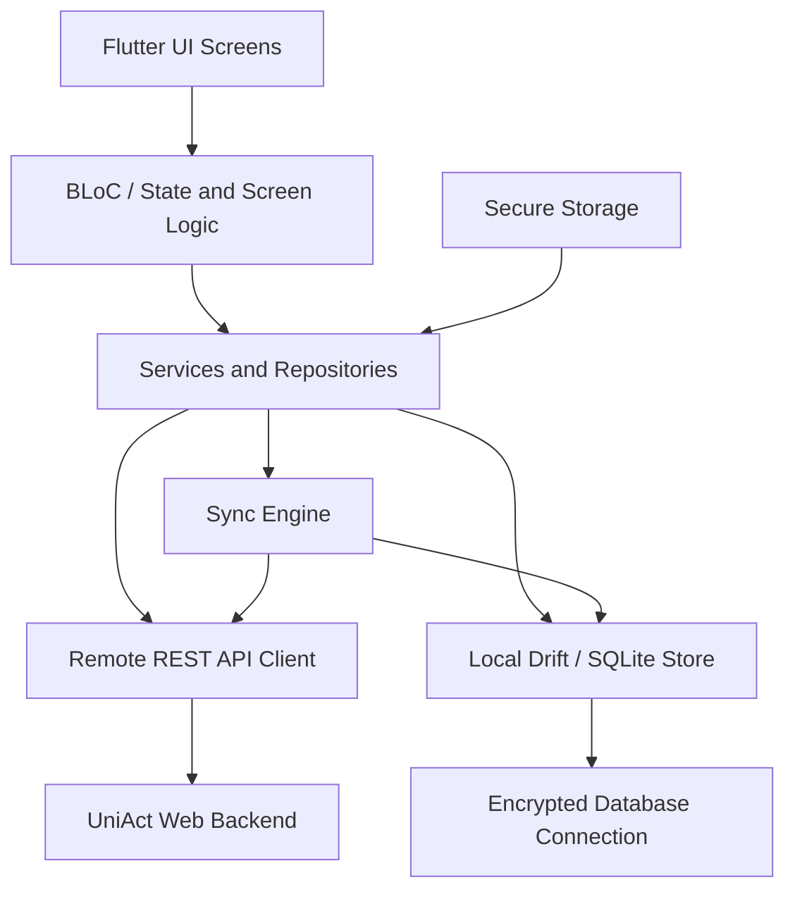

# UniAct Mobile App

<p align="center">
  
  
</p>

UniAct Mobile is the Flutter application for the UniAct university management platform. It gives students and staff a fast mobile workspace for daily academic activity: dashboards, schedules, attendance, transcripts, and learning groups.

This README is written for HR, reviewers, developers, and anyone who wants to understand what this mobile repository does, how it is structured, and why its offline-online and security architecture matters in a real university environment.

## What This App Solves

University users often need to work from classrooms, labs, lecture halls, and crowded networks where the internet connection can be unstable. UniAct Mobile is designed so important academic workflows, especially attendance, continue to behave reliably even when connectivity changes.

The app focuses on:

- Role-aware experiences for students and staff.
- Mobile access to academic dashboards and schedules.
- Attendance workflows with QR scanning and offline support.
- Learning group access for course communication and materials.
- Secure local storage for sensitive user and attendance data.
- Synchronization with the UniAct backend when the connection is available.

## Main User Roles

### Staff Experience

Staff users can use the mobile app to quickly reach the operational pages they need during teaching activity.

Key staff pages include:

- Dashboard: role summary, user information, today's schedule, and active academic context.
- Attendance: take attendance, scan QR codes, review local attendance state, and sync offline actions.
- Timetable: view teaching schedule and class sessions.
- Learning Groups: open course groups and related learning content.

### Student Experience

Student users get a learner-focused mobile experience.

Key student pages include:

- Dashboard: academic summary, registered courses, credit progress, and upcoming schedule.
- Attendance: view or participate in attendance-related flows.
- Timetable: check weekly course schedule and session details.
- Transcript: review academic progress and completed courses.
- Learning Groups: access course groups, posts, materials, and discussion context.

## Feature Overview

| Area | Purpose |
| --- | --- |
| Authentication | Login with a selected university tenant and keep the session securely on the device. |
| Dashboard | Present the most important academic and role-specific information first. |
| Attendance | Support classroom attendance workflows, QR scanning, offline queueing, and later synchronization. |
| Timetable | Show schedule information for the current user. |
| Transcript | Give students visibility into academic progress and completed credit hours. |
| Learning Groups | Connect users to course-based learning groups and shared academic content. |
| Offline Sync | Keep critical attendance data usable during network interruptions. |
| Tenant Branding | Display the active university identity and logo where available. |

## Architecture At A Glance



The app follows a layered architecture:

- UI layer: Flutter screens and reusable widgets.
- State and workflow layer: screen state, BLoC-style events, and role-aware navigation.
- Service/repository layer: separates UI from API calls, local database access, and sync rules.
- Local data layer: Drift and SQLite-based attendance storage.
- Sync layer: coordinates offline queueing, delta pulling, retry behavior, and cleanup.
- Security layer: protects tokens, user identity, and encrypted local data.

This structure keeps the app maintainable because UI changes, API changes, sync behavior, and security concerns are separated instead of being mixed inside screens.

## Online-Offline Architecture

The mobile app is built as an offline-capable client, not just a thin online-only interface.

### Why Offline Support Is Needed

In a university, attendance often happens in places where Wi-Fi or mobile data may drop. If an instructor cannot mark attendance because of a temporary network problem, the classroom workflow breaks. UniAct avoids that by allowing critical attendance actions to be stored locally and synchronized later.

### How Sync Works

The sync engine is responsible for keeping local and remote data consistent.

Core behavior:

- Connectivity monitoring detects when the device goes online or offline.
- Manual sync can be triggered from the app when pending offline actions exist.
- Automatic sync runs when connectivity is restored.
- Periodic sync runs while the app is online.
- Delta pull downloads only changed server records since the last sync timestamp.
- Queue push uploads locally created offline actions to the backend.
- Retry logic handles temporary failures without blocking the UI.
- Cleanup removes old successful queue records after they are no longer needed.

The app syncs attendance-related entities such as:

- Students.
- Courses.
- Attendance sessions.
- Schedules.
- Attendance records.

### Local-First Attendance Flow

1. The user opens attendance while online or offline.
2. The app reads available local data from the encrypted database.
3. If a network request cannot complete, the action is stored in a local sync queue.
4. The UI continues to show useful state instead of failing immediately.
5. When the device reconnects, the sync engine pushes pending changes to the backend.
6. The app pulls server changes back into the local database to stay up to date.

This is especially important for staff because attendance must be fast, reliable, and recoverable during real classroom use.

## Security Features

UniAct Mobile handles sensitive academic and identity data, so the app includes device-side security controls.

| Security Feature | Why It Matters |
| --- | --- |
| Secure token storage | Authentication tokens are stored with `flutter_secure_storage`, backed by Android Keystore and iOS Keychain behavior. |
| Encrypted local database | Attendance data is opened through an encrypted database connection using a SQLCipher-style `PRAGMA key`. |
| Device-specific key material | The database passphrase is derived from user identity plus a device identifier and application salt. |
| Bearer-token API requests | Authenticated backend requests include the user's token in the `Authorization` header. |
| Session expiry handling | Unauthorized or expired sessions can be cleared and redirected back to login. |
| No plain token files | Sensitive auth values are kept out of plain local files and normal shared preferences. |

The result is a mobile app that can work offline while still respecting the sensitivity of student, staff, attendance, and academic records.

## Technologies Used

| Technology | Purpose In This Project |
| --- | --- |
| Flutter | Cross-platform mobile UI framework used to build a single app experience for Android, iOS, desktop, and web targets. |
| Dart | Application language used across the Flutter codebase. |
| Material UI | Provides familiar mobile layout, navigation, icons, forms, and interaction patterns. |
| flutter_bloc / bloc | Supports predictable state management for complex workflows such as attendance. |
| http | Connects the app to the UniAct REST backend. |
| flutter_dotenv | Loads environment-specific configuration such as the backend API URL. |
| drift | Type-safe local database access layer. |
| sqflite / sqlite3_flutter_libs | SQLite runtime support for local persistence. |
| sqflite_sqlcipher | Supports encrypted SQLite storage patterns. |
| flutter_secure_storage | Stores tokens and sensitive identity values securely. |
| crypto | Derives hashes and passphrases for security-related operations. |
| connectivity_plus | Detects network connectivity changes for online-offline behavior. |
| mobile_scanner | Enables QR-code scanning for attendance workflows. |
| shared_preferences | Stores non-sensitive lightweight preferences. |
| path_provider / path | Resolves safe application file locations for local storage. |
| intl | Formats dates, times, and display text. |
| file_picker / url_launcher | Supports file and external-link interactions where required by learning workflows. |

## Repository Structure

```text
mobile_flutter/
  lib/
    app/                 App bootstrap, router, and global app wiring
    core/
      api/               HTTP API client and backend communication
      security/          Secure storage and encryption-key services
      storage/           Local app storage helpers
      theme/             App colors, spacing, and visual theme
      utils/             Exceptions, connectivity helpers, and shared utilities
      widgets/           Reusable UI widgets
    features/
      auth/              Login, auth service, and user model
      home/              Home shell, dashboard, role-aware navigation
      attendance/        Attendance UI, local DB, sync engine, repositories
      timetable/         Schedule and timetable screens
      transcript/        Student transcript screen
      learning_groups/   Learning group mobile experience
      splash/            Startup splash and session routing
  assets/                Images and bundled static assets
  android/ ios/          Mobile platform projects
  web/ windows/ linux/   Additional Flutter platform targets
```

## Backend Integration

The app communicates with the UniAct backend through REST API calls. After login, the app stores the auth token securely and sends it as a bearer token for protected requests.

Important backend-facing behavior:

- Login sends the selected university tenant through the `university-name` header.
- The API base URL is loaded from `.env` when available.
- Dashboard, timetable, transcript, learning group, attendance, and sync flows read from backend endpoints.
- Attendance sync pushes local queue records and pulls server changes when online.
- Session failures are handled centrally so expired access returns the user to login.

## Running The Project

### Requirements

- Flutter SDK installed.
- Dart SDK included with Flutter.
- Android Studio or Xcode if running on mobile emulators/devices.
- A reachable UniAct backend API.

### Setup

```bash
flutter pub get
```

Create or update `.env` in `mobile_flutter/`:

```env
API_BASE_URL=https://your-backend.example.com/api
```

Run the app:

```bash
flutter run
```

Build examples:

```bash
flutter build apk --release
flutter build web --release
flutter build windows --release
flutter build linux --release
```

For desktop distribution, send the full generated release folder, not only the executable, because Flutter desktop builds need the bundled data and library files beside the app binary.

## Why This Architecture Fits UniAct

UniAct is not only a content viewer. It supports real operational university work where data correctness, user identity, tenant separation, and classroom reliability matter.

The architecture was chosen because:

- Flutter gives one shared codebase for multiple platforms.
- A layered structure keeps UI, backend communication, local data, sync, and security maintainable.
- Offline-first attendance protects classroom workflows from network instability.
- Encrypted local storage allows offline capability without storing sensitive data casually.
- Sync queueing makes user actions recoverable instead of lost.
- Tenant-aware login supports a multi-university platform model.
- Repositories and services make it easier to evolve backend contracts without rewriting screens.

## Current App Screens

The screenshots at the top show the main mobile pages for both supported user experiences:

- Staff pages: dashboard, attendance, timetable, and learning groups.
- Student pages: dashboard, attendance, timetable, transcript, and learning groups.

These screenshots are included directly in the repository as:

- `docs/screenshots/staff-pages.png`
- `docs/screenshots/student-pages.png`

## Summary

UniAct Mobile is a secure, offline-capable Flutter app for university students and staff. It gives users practical access to daily academic workflows while protecting sensitive data and synchronizing with the backend when the network is available.

For HR or non-technical reviewers, the key idea is simple: this mobile app helps university users keep working from their phones, even when connectivity is imperfect, while preserving the structure, security, and reliability expected from an academic management system.
